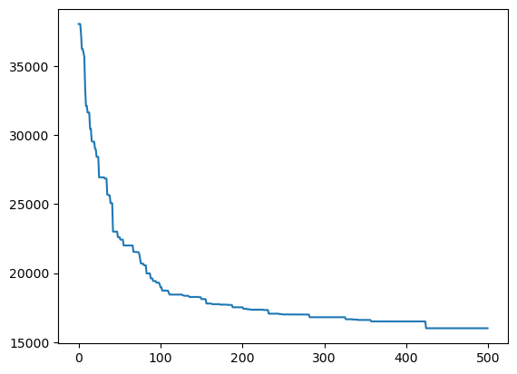
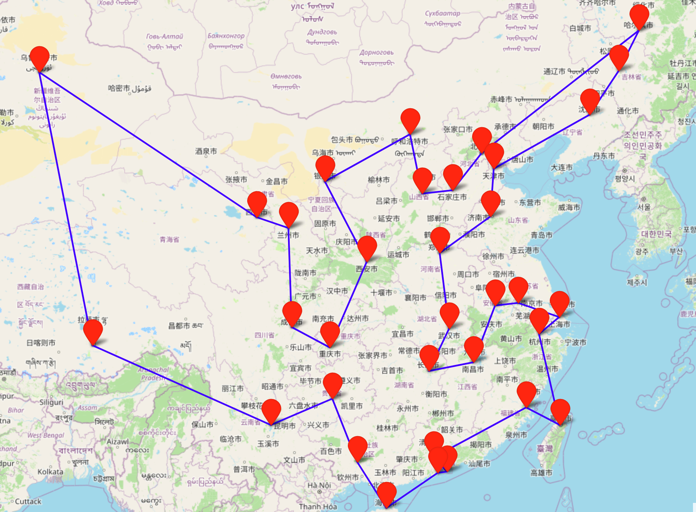
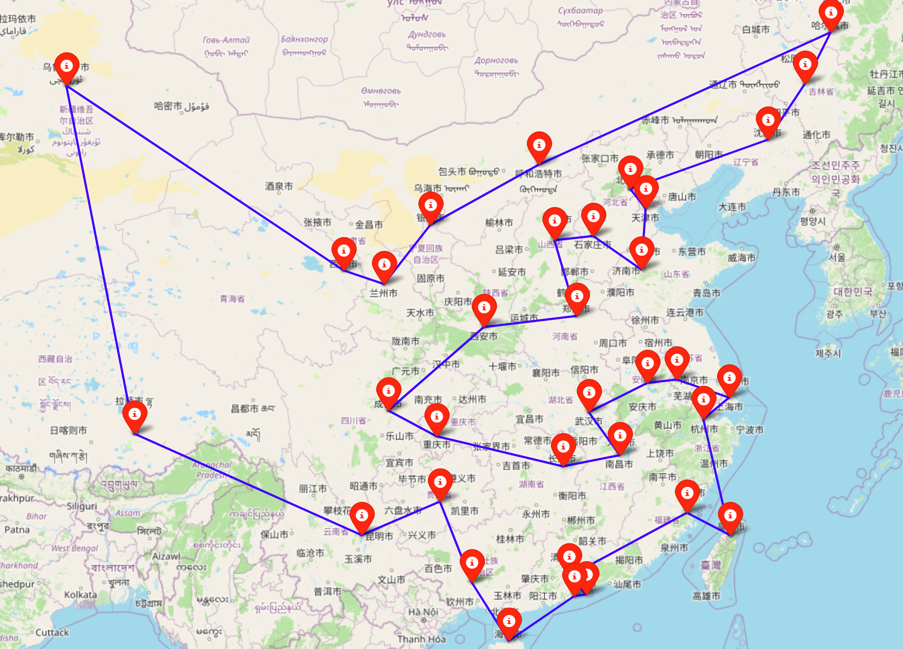
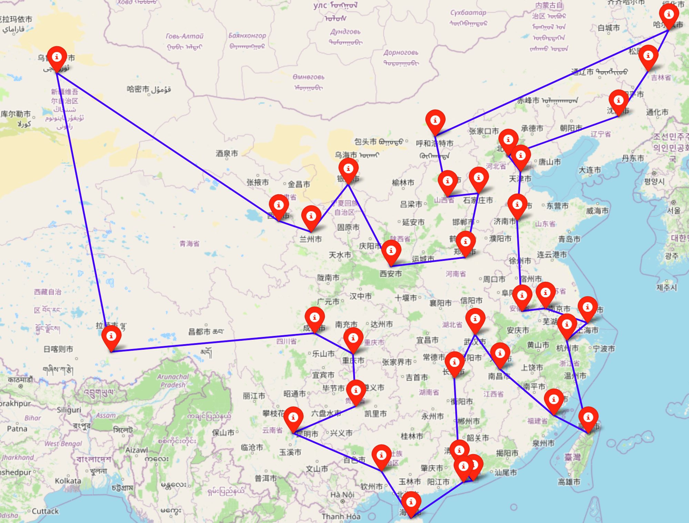

## TSP问题
TSP问题，即旅行商问题（Traveling Salesman Problem），是组合优化问题中的一个经典问题。这个问题可以描述为：给定一个包含 $n$ 个城市的列表，以及每对城市之间的距离，旅行商需要找到一条最短的路径，使得他能够访问每一个城市恰好一次，并最终返回到起点。

TSP问题是一个 NP-hard 问题，这意味着随着问题规模的增加，找到精确解所需的时间会呈指数增长。 例如，下图显示了一个仅有四个位置（分别标记为 A、B、C 和 D）的 TSP。任意两个位置之间的距离由连接这两个位置的边旁边的数字指定。

通过计算所有可能路线的距离，可以看到最短路线是 ACDBA，总距离为 $35 + 30 + 15 + 10 = 90$。

地点越多，问题就越难。上面的示例中只有六条路线。但如果有$10$个地点（不计算起点），则数量为 $362880$。如果是 $20$ 个地点，此时路线的数量会暴涨到 $2432902008176640000$。 所有详尽搜索所有可能的路线可以保证找到最短路径，对于更大规模的问题，需要使用优化技术智能搜索解决方案空间，并找到最佳（或接近优化）的解决方案。

## 求解方式
接下来本文将展示不同的办法来解决TSP问题，其中问题的地点为中国所有的省会以及直辖市，总计$34$个地点。
### 启发式算法
启发式算法有很多，本文将会采用遗传算法求解。scikit-opt是一个封装了7种启发式算法的 Python 代码库，所以本文直接调库中的封装好的遗传算法求解。设定算法的种群个数为$50$，最大迭代次数为$500$，变异概率为$1$，最终求解目标值为16013公里, 求解时间为1.0906s。算法的收敛效果如下：

当然，也可以不断调整参数，直到找到最优解，笔者就不去慢慢尝试了。最终的环绕中国城市的路线为下图所示:

### OR-tools
OR-Tools 是一种用于组合优化的开源软件，该软件力求从一组可能的大量解决方案中找出某个问题的最佳解决方案。其实本质上OR-tools还是利用启发式算法求解TSP问题的，所以不一定保证解的最优性。该工具的求解结果为15832公里，求解时间为0.0349s。以上的结果默认参数的结果，其实笔者也试过调整or-tools的搜索参数，使用更高级的搜索策略，可以实现最优解的，但速度比较慢。环绕路线为：

可以看出来OR-tools的结果比GA更优，且速度更快。
### Gurobi
本文采用Gurobi的lazyconstraint功能来消除子回路求解TSP。 求解结果为156888公里，求解时间为0.119s。
环绕路线为：

## 总结
不同方式的求解结果如下表所示：
| 方法 | 求解结果 | 求解时间 |
| --- | --- | --- |
| Genetic Algorithm | 16013 | 1.0906s |
| OR-tools | 15832 | 0.0349s |
| Gurobi | 156888 | 0.119s |

这几种方法都可以实现求解TSP问题，但原始的遗传算法可能效率比较慢，而OR-tools和Gurobi则比较快， 并且Gurobi的求解结果可以保证最优解。

## 参考资料
[1] [scikit-opt](https://scikit-opt.github.io/scikit-opt/#/zh)

[2] [OR-tools-旅行推销员问题](https://developers.google.com/optimization/routing/tsp?hl=zh-cn)

